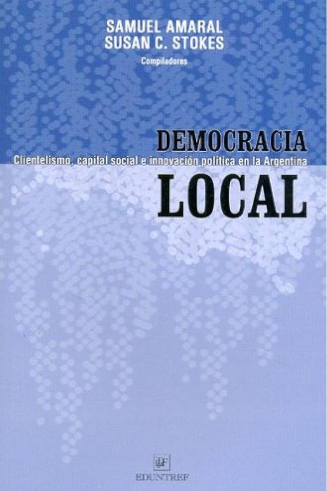

  
  
```{r setup, include=FALSE}
knitr::opts_chunk$set(echo = FALSE)
```

Click book cover for more information:

[{#id .class width=30% out.extra='style="float:right; padding:10px"'}](book-trashtalk.html)
[{#id .class width=30% out.extra='style="float:right; padding:10px"'}](book-whybother.html)
[{#id .class width=30% out.extra='style="float:right; padding:10px"'}](book-brokers.html)
[{#id .class width=30% out.extra='style="float:right; padding:10px"'}](book-skepticism.html)
[{#id .class width=30% out.extra='style="float:right; padding:10px"'}](book-mandates.html)
[{#id .class width=30% out.extra='style="float:right; padding:10px"'}](book-peru.html)


## Edited Volumes

[{#id .class width=30% out.extra='style="float:right; padding:10px"'}](book-pol-rep.html)
[{#id .class width=30% out.extra='style="float:right; padding:10px"'}](book-designing.html)
[{#id .class width=30% out.extra='style="float:right; padding:10px"'}](book-handbook.html)
[{#id .class width=30% out.extra='style="float:right; padding:10px"'}](book-democracia.html)
[{#id .class width=30% out.extra='style="float:right; padding:10px"'}](book-market-reforms.html)
[{#id .class width=30% out.extra='style="float:right; padding:10px"'}](book-dar.html)


